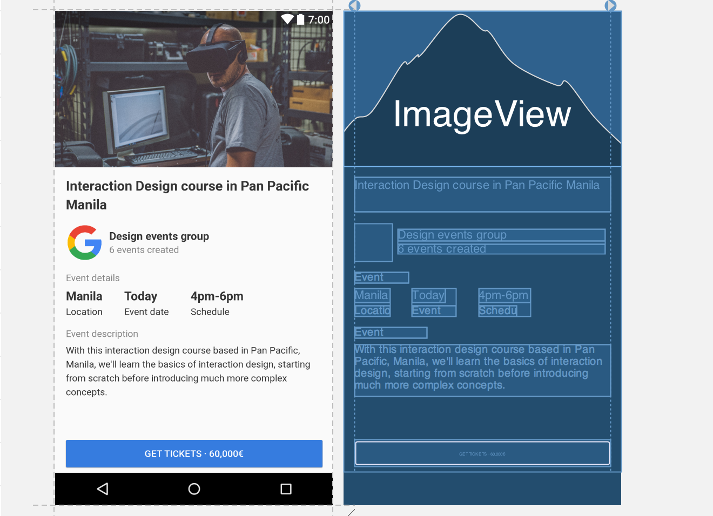

# ConstraintLayout sample

Although ConstraintLayout came out in Google IO 2016, I haven’t put aside time for learning it. Before I started this project, I’ve spent a week learning ConstraintLayout, going through [official google documentation]((https://developer.android.com/training/constraint-layout/index.html)) and various other blogs. To put my learning to test, I made this sample project. The UI isn’t complex but it’s complicated enough to have a good understanding of ConstraintLayout.

## UI

Nothing fancy here. A UI which would typically require multiple layout hierarchies while developing.

## My observation

I am impressed by the features ConstraintLayout provides. It definitely helps in flattening hierarchies. Although I'm one of those developers who prefer typing out code, I thoroughly enjoyed dragging and dropping views and the simplicity of setting constraints provided by layout editor.

I was using v1.0.2 of ConstraintLayouts in this project. I ran into various bugs, albeit it was a stable release. Sometimes the margin I set changed automatically. It took me more time to develop and I wasn't able to design certain UIs like the screenshot below. I didn't find a solution to vertically center two views with respect to another view.

Instead, I used LinearLayout to group two TextViews together and then used ConstraintLayout's properties to vertically align the LinearLayout with the ImageView on the left.

## Learning resources

[https://developer.android.com/training/constraint-layout/index.html](https://developer.android.com/training/constraint-layout/index.html)

[https://www.youtube.com/watch?v=z53Ed0ddxgM](https://www.youtube.com/watch?v=z53Ed0ddxgM)